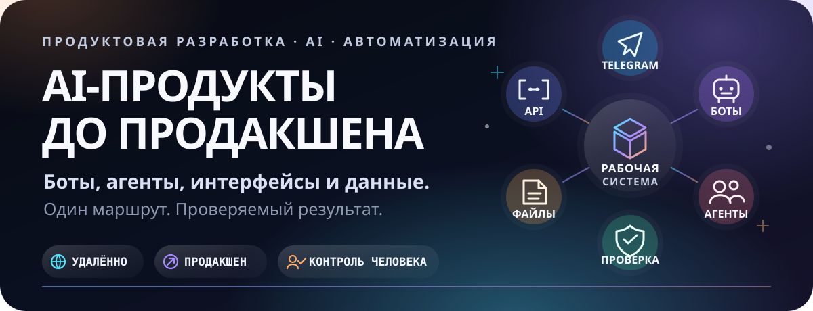

<p align="center">
  
</p>

<p align="center">
  <strong>Открыт к удалённой работе</strong>
  ·
  <a href="https://t.me/ai_nickolai">Telegram</a>
  ·
  <a href="https://github.com/Tonivecher?tab=repositories">Репозитории</a>
</p>

## Не отдельные фичи. Цельные рабочие контуры

Моё сильное место — связать интерфейс, API, данные, Telegram-бота,
AI-агентов, обработку файлов, контроль качества и решение человека в одну
систему, которая действительно работает.

<p align="center">
  
</p>

### Что умею связывать

- **AI и мультиагентные системы** — маршрутизация задач по ролям, состояние
  этапов, артефакты, блокирующий QA и явное одобрение владельца.
- **Telegram-боты и интеграции** — приватное подключение, команды, уведомления,
  управление задачами, доставка результатов, webhooks и n8n-сценарии.
- **Документы и данные** — приём, проверка и обработка PDF, DOCX, XLSX,
  изображений и текстовых материалов.
- **Full-Stack продукты** — React, TypeScript, Python, FastAPI, Node.js,
  Express, PostgreSQL, SQLite, Prisma и REST API.
- **Продакшен и восстановление** — сборка, тесты, деплой, health-checks,
  системные сервисы, резервные копии, диагностика и безопасное восстановление.
- **Продуктовая работа** — превращаю реальный бизнес-процесс в понятный
  интерфейс, устойчивую модель состояния и проверяемый результат.

## Флагманские проекты

### Agent Office — управляемый офис AI-агентов

[](https://vershina.tonivecher.online/)

Живой офис из **18 специализированных ролей**: сотрудники получают поручения,
работают по этапам, передают результат дальше и остаются под контролем
владельца. Веб-интерфейс связан с FastAPI-ядром, постоянным состоянием задач,
файловым контуром и Telegram.

**Показывает:** multi-agent orchestration, human-in-the-loop, Telegram control,
обработку документов, QA-гейты и приватный доступ.

[Живой продукт](https://vershina.tonivecher.online/) ·
[Публичный кейс](https://github.com/Tonivecher/agent-office-case-study) ·
исходный код закрыт

---

### FORMALAB PRO — продуктовый интерфейс для сложного производства

[](https://formalabpro.tech/)

Продакшен-интерфейс для студии индивидуальной мебели и архитектурных решений:
портфолио, материалы, инженерный процесс, два визуальных режима и
структурированный бриф клиента.

**Показывает:** продуктовую архитектуру фронтенда, сложный адаптивный UI,
motion-систему, SEO, валидацию форм и доведение публичного продукта до запуска.

[Живой продукт](https://formalabpro.tech/) ·
[Исходный код](https://github.com/Tonivecher/FORMALABPRO)

---

### SVT WaterTech Hub — промышленный B2B-продукт

[](https://svt.tonivecher.online/)

Хаб промышленного водоочистного оборудования: каталог, инженерные решения,
калькулятор, сборка коммерческого предложения, технические документы и
маршруты обращений.

**Показывает:** работу со сложным предметным содержанием, B2B-воронкой,
состоянием предложения, формами, визуализацией данных и адаптивной навигацией.

[Живой продукт](https://svt.tonivecher.online/) ·
[Публичный кейс](https://github.com/Tonivecher/svt-watertech-case-study) ·
исходный код закрыт

---

### Project Control — операционная система управления проектами

Внутренний продукт, связывающий этапы, задачи, решения, вопросы клиента,
отчётность, базу знаний и автоматизацию. React-интерфейс работает поверх
Express, Prisma и PostgreSQL; отдельные процессы описаны n8n-сценариями.

**Показывает:** проектирование внутренних систем, сложную модель состояния,
рабочие панели, историю решений, контролируемый клиентский доступ и
операционные интеграции.

[Публичный кейс](https://github.com/Tonivecher/project-control-case-study) ·
исходный код закрыт

## Инженерный подход

```text
Понять реальный процесс
        ↓
Описать состояние и границы
        ↓
Собрать короткий рабочий маршрут
        ↓
Проверить результат на живой системе
        ↓
Зафиксировать эксплуатацию и восстановление
```

Не выдаю макет за продукт и ответ модели за готовый результат. В работе важны
реальные артефакты, честные ошибки, воспроизводимые проверки и понятная
передача следующему инженеру.

## Проверенный технический контур

`React 18/19` · `TypeScript` · `Vite` · `Python` · `FastAPI` · `Node.js` ·
`Express` · `PostgreSQL` · `SQLite` · `Prisma` · `Telegram Bot API` · `n8n` ·
`Nginx` · `systemd`

Для флагманских кейсов проверялись production-сборки и живые endpoints.
Agent Office дополнительно проходил frontend workflow-тесты и backend-тесты.
Точные границы проверки зафиксированы в README каждого кейса.

## Публичная граница

В открытом доступе находятся проверяемые интерфейсы, архитектурные схемы,
описание моей роли и результаты проверок. Приватными остаются клиентские
данные, секреты, production-конфигурация, внутренние инструкции и наиболее
ценная часть исходного кода.

## Связаться

Ищу удалённую работу в направлении **AI Product Engineering / Full-Stack /
Automation**. Интересны продукты, где нужно не просто написать код, а связать
людей, данные, интерфейсы и автоматизацию в работающую систему.

[Написать в Telegram](https://t.me/ai_nickolai)

<sub>© 2026 Николай. Материалы портфолио опубликованы для профессиональной оценки.</sub>
