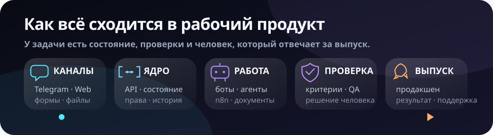

  

  <strong>Открыт к удалённой работе</strong>
  ·
  <a href="https://t.me/ai_nickolai">написать в Telegram</a>
  ·
  <a href="https://github.com/Tonivecher?tab=repositories">посмотреть репозитории</a>

## Делаю сложное понятным. Потом запускаю

Мне интересны процессы, в которых одного сайта или бота мало. Заявка приходит
из Telegram, к ней прикладывают документы, дальше нужны API, несколько
исполнителей, проверка результата и решение человека. Я проектирую весь этот
маршрут: вход, состояние, исполнение, проверку и выпуск.

  

### AI без магического мышления

Агент получает роль, входные данные и критерий готовности. Его результат
остаётся артефактом, который можно открыть и проверить. Если решение влияет на
клиента, деньги или инфраструктуру, последнее слово остаётся за человеком.

### Бот как часть продукта

Telegram-бот умеет больше, чем отвечать на команды. Через него можно поставить
задачу, передать файл, получить уведомление, остановить процесс и забрать
результат. Состояние при этом живёт на сервере, а не пропадает вместе с чатом.

### От интерфейса до сервера

Собираю React-интерфейсы, API на Python или Node.js, модели данных, очереди
действий и n8n-сценарии. Работаю с PDF, DOCX, XLSX, изображениями и текстом.
Выбираю стек под процесс, а не процесс под любимую библиотеку.

### Продакшен тоже входит в работу

Не люблю демо, которое разваливается после первого клика. Проверяю сборку,
тесты и работу сервиса. Разбираюсь с Nginx, systemd, логами, резервными копиями
и восстановлением, когда проблема уже вышла за пределы приложения.

## Проекты, которые можно открыть

### Agent Office

Самый показательный проект. Это не чат с персонажами, а рабочий офис из
**18 специализированных ролей**. Сотрудники получают поручения, переходят между
этапами, передают артефакты и ждут решения владельца там, где автоматика не
должна решать сама.

Внутри работают React, FastAPI, постоянное состояние задач, обработка файлов и
управление через Telegram. Доступ открывается после приватной привязки через
Telegram.

[Открыть живой офис ↗](https://vershina.tonivecher.online/) ·
[Разобрать публичный кейс ↗](https://github.com/Tonivecher/agent-office-case-study)

### FORMALAB PRO

Здесь сложное производство нужно было объяснить без технической каши.
Получился живой продукт для студии индивидуальной мебели: проекты, материалы,
инженерный процесс, два визуальных режима и бриф, который собирает исходные
данные до разговора с клиентом.

Моя зона ответственности: структура продукта, архитектура фронтенда,
адаптивный интерфейс, анимация, SEO, формы, релизная сборка и запуск.

[Открыть продукт ↗](https://formalabpro.tech/) ·
[Посмотреть исходный код ↗](https://github.com/Tonivecher/FORMALABPRO)

### SVT WaterTech Hub

Промышленному покупателю мало каталога. Ему нужно сопоставить оборудование,
сценарий применения, производительность, бюджет и состав предложения. Хаб
собирает эти шаги в одном интерфейсе и не заставляет начинать поиск заново на
каждой странице.

В продукт вошли каталог, инженерные решения, калькулятор, конструктор
коммерческого предложения, документы и формы обращения.

[Открыть продукт ↗](https://svt.tonivecher.online/) ·
[Посмотреть публичный кейс ↗](https://github.com/Tonivecher/svt-watertech-case-study)

### Project Control

Когда проект одновременно живёт в таблицах, чатах и головах участников,
решения теряются первыми. Project Control хранит этапы, задачи, вопросы
клиента, отчёты и базу знаний в одной модели.

Интерфейс написан на React. Данные проходят через Express, Prisma и PostgreSQL;
часть операционных процессов вынесена в n8n. Исходный код закрыт, но
архитектура и границы продукта описаны в отдельном кейсе.

[Посмотреть публичный кейс ↗](https://github.com/Tonivecher/project-control-case-study)

## Как я работаю

Сначала ищу место, где процесс ломается или теряет данные. Затем описываю
состояния, роли и границы доступа. После этого собираю самый короткий маршрут,
который даёт законченный результат.

Автоматизация считается готовой, только когда результат можно проверить.
Сборка должна собираться. Проверка готовности должна проходить. Ошибка должна
быть честной и понятной следующему инженеру.

## Рабочий стек

Чаще всего использую `React`, `TypeScript`, `Vite`, `Python`, `FastAPI`,
`Node.js`, `Express`, `PostgreSQL`, `SQLite`, `Prisma`, `Telegram Bot API`,
`n8n`, `Nginx` и `systemd`.

У флагманских проектов проверены релизные сборки и живые адреса сервисов.
Agent Office дополнительно прошёл пять сценарных тестов интерфейса и 47 тестов
серверной части. Точный объём проверки указан в каждом публичном кейсе.

## Что остаётся закрытым

Публичного материала достаточно, чтобы оценить интерфейс, архитектуру и
качество реализации. Клиентские данные, секреты, конфигурация серверов,
внутренние инструкции и основная часть закрытых продуктов в GitHub не
публикуются.

## Ищу удалённую команду

Интересны продукты, где AI и автоматизация решают настоящую операционную
задачу. Если нужен инженер, который может разобрать процесс, собрать систему
целиком и довести её до работающего сервиса, напишите мне.

[Обсудить работу в Telegram ↗](https://t.me/ai_nickolai)

© 2026 Tonivecher. Материалы опубликованы для профессиональной оценки.
