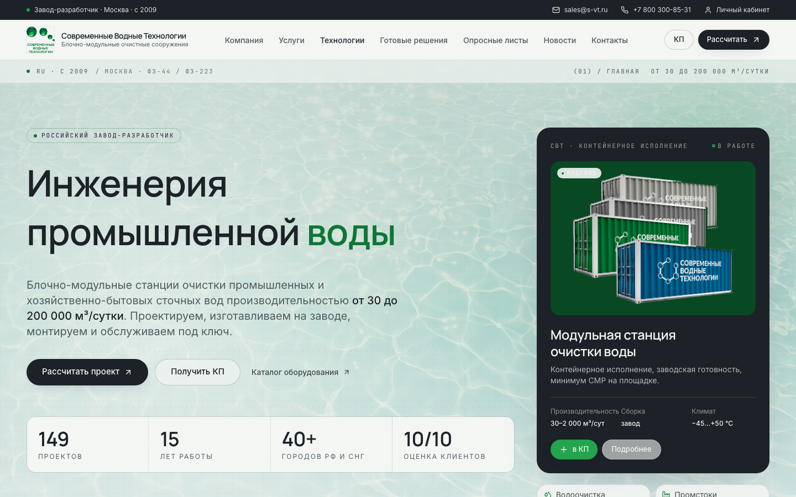

<h1 align="center">Nikolay · AI Product & Full-Stack Engineer</h1>

<p align="center">
  I build B2B systems, internal tools and automation that reach production.
</p>

<p align="center">
  React · TypeScript · Python · FastAPI · Node.js · PostgreSQL · Product Engineering
</p>

<p align="center">
  <a href="https://formalabpro.tech/">Live product</a>
  ·
  <a href="https://t.me/ai_nickolai">Telegram</a>
  ·
  Open to remote roles
</p>

## Selected work

### FORMALAB PRO

[](https://formalabpro.tech/)

Production frontend for a custom furniture and architectural millwork studio.
React 19, TypeScript, motion systems, two visual modes and a structured client
brief.

[Live](https://formalabpro.tech/) ·
[Source](https://github.com/Tonivecher/FORMALABPRO)

### SVT WaterTech Hub

[](https://svt.tonivecher.online/)

Industrial B2B product hub with equipment, engineering solutions, calculation
and proposal flows. Public case study; production source remains private.

[Live](https://svt.tonivecher.online/) ·
[Case study](https://github.com/Tonivecher/svt-watertech-case-study) ·
Private source

### Agent Office

A server-authoritative workspace for routed AI tasks, file intake, owner review
and Telegram control. The implementation combines a React control surface with
a FastAPI execution core and durable task state.

`React 19` · `FastAPI` · `SQLite` · `Telegram` · `document processing`

[Case study](https://github.com/Tonivecher/agent-office-case-study) ·
Private source

### Project Control

An internal operations system connecting project stages, tasks, decisions,
client questions, reporting and knowledge workflows through a React interface
and an Express/Prisma backend.

`React 19` · `Express` · `Prisma` · `PostgreSQL` · `n8n`

[Case study](https://github.com/Tonivecher/project-control-case-study) ·
Private source

## What I work on

- AI-enabled products with explicit human approval gates.
- Full-stack web systems and operational dashboards.
- Telegram workflows, file pipelines and business automation.
- Production handoff: builds, tests, deployment notes and recovery boundaries.

## How I build

```text
Understand the workflow
        ↓
Model the state
        ↓
Ship the smallest complete path
        ↓
Verify the real result
        ↓
Document the operational boundary
```

I care about clear interfaces, durable state, honest failure handling and
systems another engineer can continue without reconstructing the whole project.

## Contact

I am open to remote product-engineering and full-stack roles.

[Telegram](https://t.me/ai_nickolai) ·
[GitHub](https://github.com/Tonivecher)
