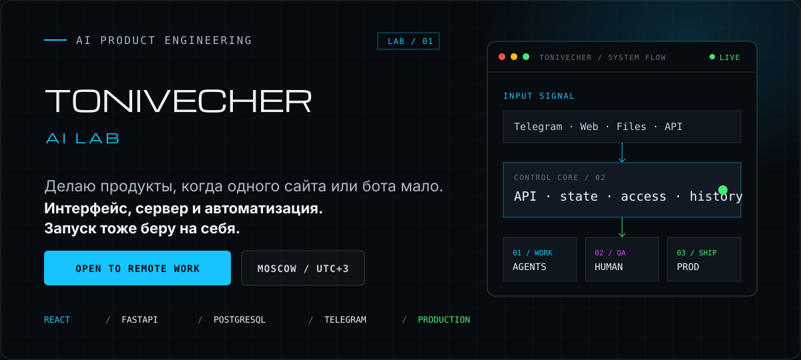
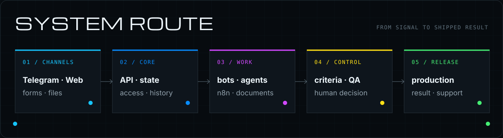
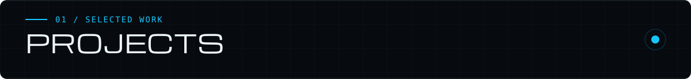
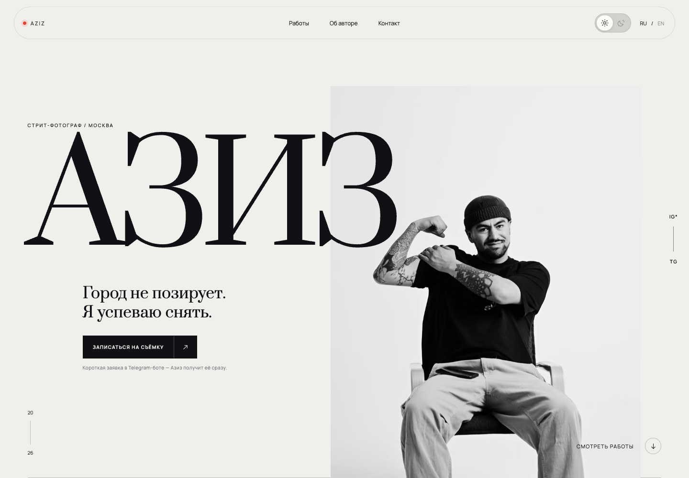
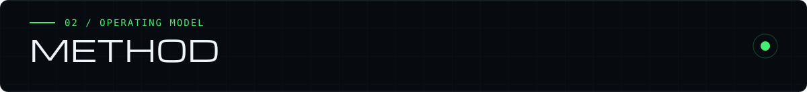
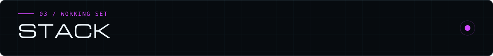
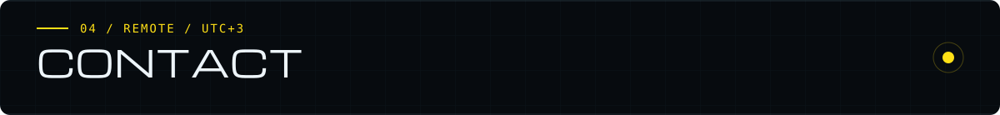

  

  <a href="https://t.me/ai_nickolai"><strong>Telegram</strong></a>
  &nbsp;·&nbsp;
  <a href="https://github.com/Tonivecher?tab=repositories"><strong>Репозитории</strong></a>
  &nbsp;·&nbsp;
  <strong>Открыт к удалённой работе</strong>

## Одного сайта или бота часто недостаточно

Обычно всё начинается с сообщения в Telegram, пары файлов и таблицы, в которой
уже никто ничего не находит. Дальше выясняется, что людям приходится вручную
переносить данные, напоминать друг другу о сроках и проверять результат в пяти
местах.

Я разбираюсь, где именно теряется работа, и собираю всё в один продукт. Если
нужны интерфейс, сервер, бот, обработка документов и автоматизация — делаю их
как части одной системы, а не как пять отдельных поделок.

  

  

### 01 / Agent Office

Мой основной проект. Внутри работают **18 AI-сотрудников** с разными ролями:
разработчик, дизайнер, аналитик, тестировщик и другие. Им можно поставить задачу,
приложить файлы и посмотреть, кто сейчас работает, кто закончил, а кто ждёт
ответа владельца.

Это не набор персонажей в чате. У задач есть этапы, история, файлы и постоянное
состояние на сервере. Управлять офисом можно через веб-интерфейс и Telegram.

`REACT` · `FASTAPI` · `TELEGRAM` · `PERSISTENT STATE` · `FILE PROCESSING`

[Открыть живой офис ↗](https://vershina.tonivecher.online/) ·
[Разобрать публичный кейс ↗](https://github.com/Tonivecher/agent-office-case-study)

---

### 02 / AZIZ Photography Platform

Сайт фотографа, Telegram-бот и управление портфолио работают как одна система.
Клиент смотрит фотографии, нажимает кнопку записи и сразу заполняет короткую
заявку в Telegram. Азиз получает её с источником перехода и рабочими статусами.

Через того же бота владелец загружает фотографию с телефона, проверяет черновик,
добавляет описание и публикует работу. Бот не получает прямого доступа к базе:
SQLite, обработка изображений и публичная галерея остаются на стороне сайта.

`REACT` · `EXPRESS` · `SQLITE` · `TELEGRAM BOT API` · `IMAGE SEO` · `NGINX`

[Открыть живой сайт ↗](https://aziz.tonivecher.online/) ·
[Посмотреть весь исходный код ↗](https://github.com/Tonivecher/aziz-photography-platform)

---

### 03 / FORMALAB PRO

Сайт для студии индивидуальной мебели. Нужно было показать не только красивые
интерьеры, но и то, как устроена работа: замеры, материалы, проектирование,
производство и монтаж.

Я собрал структуру, фронтенд, адаптивную версию, анимацию, SEO и формы. Отдельно
сделал бриф, чтобы клиент мог передать размеры, пожелания и референсы до первого
созвона.

`PRODUCT STRUCTURE` · `FRONTEND ARCHITECTURE` · `MOTION` · `SEO` · `RELEASE`

[Открыть продукт ↗](https://formalabpro.tech/) ·
[Посмотреть исходный код ↗](https://github.com/Tonivecher/FORMALABPRO)

---

### 04 / SVT WaterTech Hub

Промышленное оборудование трудно выбирать по обычному каталогу. Покупателю
нужно сравнить производительность, понять схему применения, прикинуть бюджет и
получить нормальное коммерческое предложение.

Для этого я собрал каталог, страницы инженерных решений, калькулятор и
конструктор предложения. Документы и заявки находятся там же — не приходится
начинать поиск заново на каждой странице.

`CATALOG` · `ENGINEERING FLOWS` · `CALCULATOR` · `DOCUMENTS` · `FORMS`

[Открыть продукт ↗](https://svt.tonivecher.online/) ·
[Посмотреть публичный кейс ↗](https://github.com/Tonivecher/svt-watertech-case-study)

---

### 05 / Project Control

Закрытая система для проектов, которые раньше жили одновременно в таблицах,
чатах и головах участников. В одном месте собраны этапы, задачи, вопросы
клиента, отчёты и база знаний.

Фронтенд написан на React, сервер — на Express. Данные хранятся в PostgreSQL
через Prisma, повторяющиеся действия автоматизированы в n8n. Код закрыт, поэтому
в публичном репозитории показываю устройство системы и принятые решения.

`REACT` · `EXPRESS` · `PRISMA` · `POSTGRESQL` · `N8N`

[Посмотреть публичный кейс ↗](https://github.com/Tonivecher/project-control-case-study)

  

### AI должен делать работу, а не изображать интеллект

У агента должна быть конкретная задача, исходные данные и понятный признак
готовности. После работы должен остаться результат, который можно открыть и
проверить: файл, отчёт, код или заполненная карточка.

Если ошибка может задеть клиента, деньги или сервер, решение подтверждает
человек. Автоматизация здесь помогает, но не получает права самостоятельно
менять продакшен.

### Telegram — это пульт, а не весь продукт

Через бота удобно отправить задачу, приложить документ, получить уведомление или
остановить выполнение. Но сами задачи, права доступа и история должны храниться
на сервере. Иначе после перезапуска бота половина работы просто исчезнет.

### Не делю работу на «моё» и «не моё»

Если интерфейсу не хватает API — пишу API. Если бот должен принять PDF и вернуть
готовый XLSX — собираю обработку файлов. Если задача должна пережить перезапуск,
добавляю базу и очередь. Стек выбираю после того, как понял задачу, а не наоборот.

### Работа не закончена, пока сервис нельзя нормально запустить

Проверяю сборку и основные сценарии, настраиваю запуск, смотрю логи. Приходилось
чинить Nginx, systemd, сертификаты, резервные копии и восстановление. Демо на
ноутбуке не считаю готовым продуктом.

  

`React` · `TypeScript` · `Vite` · `Python` · `FastAPI` · `Node.js` · `Express`
· `PostgreSQL` · `SQLite` · `Prisma` · `Telegram Bot API` · `n8n` · `Nginx` ·
`systemd`

У проектов выше проверены релизные сборки и живые адреса. Для Agent Office я
прогнал пять полных сценариев через интерфейс и 47 серверных тестов. В каждом
публичном кейсе отдельно написал, что именно проверял — без расплывчатого
«всё протестировано».

> Клиентские данные, ключи, серверные конфиги и внутренние инструкции я не
> публикую. Для закрытых проектов показываю только то, по чему можно оценить мою
> работу: интерфейс, устройство системы и проверяемый результат.

  

Ищу удалённую команду, которой нужен не ещё один лендинг с чат-ботом, а рабочий
продукт вокруг реального процесса. Могу разобраться в задаче, собрать систему и
довести её до сервера. Если это похоже на вашу работу — напишите.

  <a href="https://t.me/ai_nickolai"><strong>Обсудить работу в Telegram ↗</strong></a>

© 2026 Tonivecher · AI LAB. Материалы опубликованы для профессиональной оценки.
